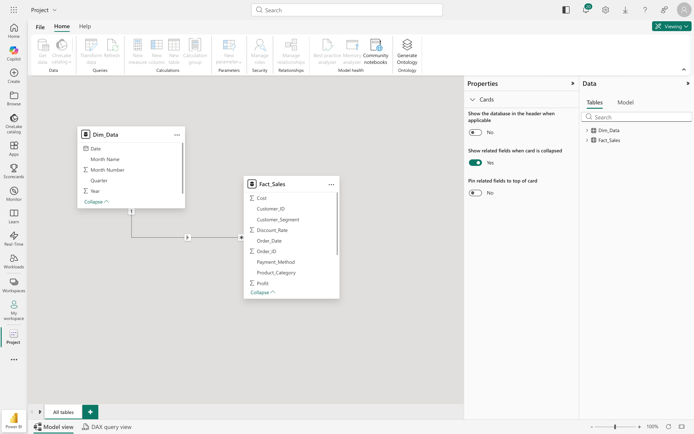

# 📊 Sales Performance & Financial Insights Dashboard (2024)

## 📋 Project Overview
This interactive dashboard was developed using **Power BI Service** to provide strategic insights into sales performance for the year 2024. The project transforms raw transactional data into actionable financial intelligence, focusing on revenue trends, profitability, and customer behavior.

## 🏗️ Data Modeling
I implemented a **Star Schema** to ensure data integrity and optimal report performance:
* **Dim_Data (Dimension):** A custom-built date table created to enable advanced **Time Intelligence** analysis.
* **Fact_Sales (Fact):** The central table containing all sales transactions and metrics.
* **Relationship:** A **One-to-Many (1:*)** relationship was established between `Dim_Data` and `Fact_Sales`.

### Data Model Preview:
 

## 🛠️ Tools & Methodology
* **Power BI Service:** The entire project was built and managed in the cloud.
* **Data Source:** Raw dataset sourced from **Kaggle**.
* **Calculations:** Used **Visual Calculations** to derive the **Net Profit Margin % (35%)**.

## 📈 Key Business Insights
* **Financial Standing:** Achieved a total revenue of **$11.95M** with a net profit of **$4.19M**.
* **Efficiency:** Maintained a consistent **35% Profit Margin** throughout the year, reflecting stable cost management.
* **Seasonality:** Identified peak performance in **July and September**, while February and November showed the lowest revenue.
* **Customer Preferences:** **Debit Cards** are the leading payment method, accounting for 20.69% of transactions.

---

## 📂 Deliverables & Access

| Asset | Description | Link |
| :--- | :--- | :--- |
| **Final Dashboard** | Full preview of KPIs and charts | [View Image](
) |
| **Data Model** | Semantic model and relationships | [View Image](Data_Model.png) |

